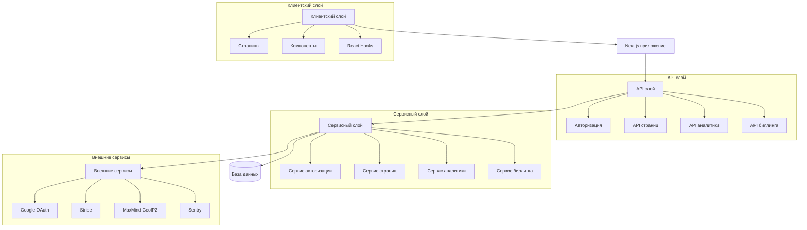
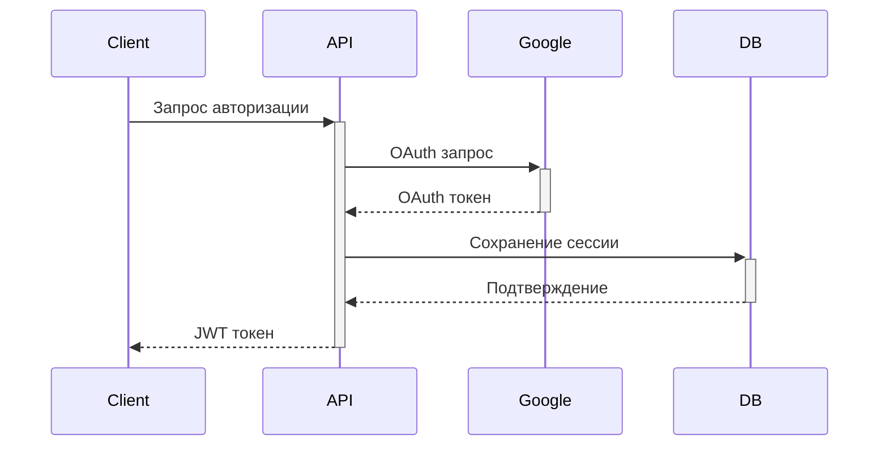
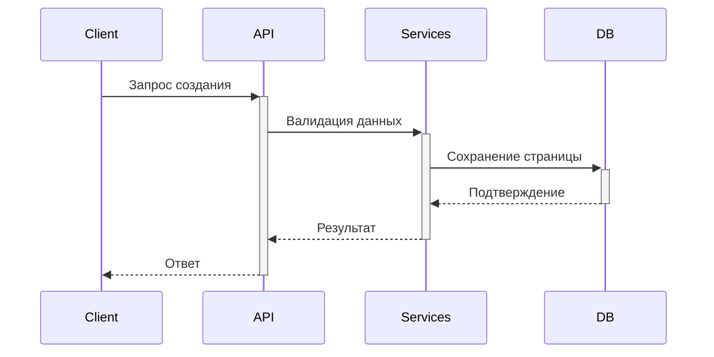
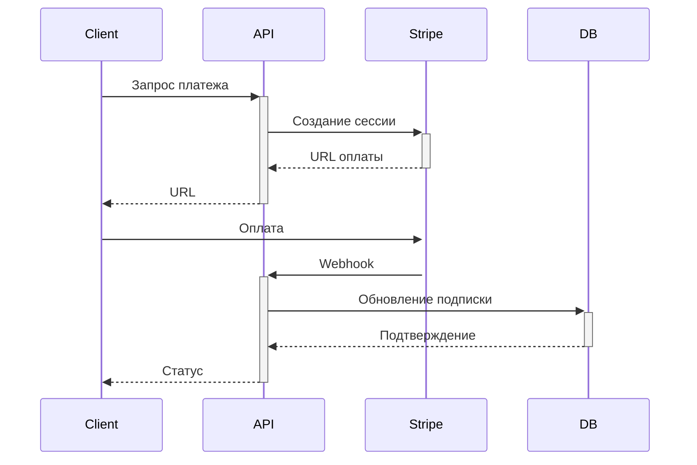

# Архитектура проекта

## Общая структура

## Компоненты системы

### Клиентский слой
- **Страницы** (`app/`): Next.js страницы приложения
- **Компоненты** (`components/`): React компоненты
- **Хуки** (`hooks/`): React хуки для управления состоянием

### API слой
- **Авторизация** (`app/api/auth/`): Обработка авторизации
- **API страниц** (`app/api/pages/`): Управление страницами
- **API аналитики** (`app/api/analytics/`): Сбор и анализ данных
- **API биллинга** (`app/api/billing/`): Обработка платежей

### Сервисный слой
- **Сервис авторизации** (`services/auth.ts`): Логика авторизации
- **Сервис страниц** (`services/pages.ts`): Бизнес-логика страниц
- **Сервис аналитики** (`services/analytics.ts`): Обработка аналитики
- **Сервис биллинга** (`services/billing.ts`): Обработка платежей

### База данных
- **PostgreSQL**: Основная база данных
- **Prisma**: ORM для работы с базой данных
- **Миграции** (`prisma/migrations/`): История изменений схемы

### Внешние сервисы
- **Google OAuth**: Авторизация через Google
- **Stripe**: Обработка платежей
- **MaxMind GeoIP2**: Определение геолокации
- **Sentry**: Мониторинг ошибок

## Потоки данных

### Авторизация

### Создание страницы

### Обработка платежа

## Безопасность

### Аутентификация
- JWT токены для API
- OAuth 2.0 для внешних сервисов
- Сессии в базе данных

### Авторизация
- Роли пользователей (user, admin)
- Проверка прав доступа
- Лимиты по тарифам

### Защита данных
- HTTPS для всех запросов
- Валидация входных данных
- Санитизация выходных данных

## Масштабирование

### Горизонтальное масштабирование
- Статические файлы на CDN
- База данных с репликацией
- Кэширование на уровне API

### Вертикальное масштабирование
- Оптимизация запросов
- Индексация базы данных
- Мониторинг производительности

## Мониторинг

### Метрики
- Время ответа API
- Использование ресурсов
- Ошибки и исключения

### Логирование
- Структурированные логи
- Трейсинг запросов
- Аудит действий

## Развертывание

### CI/CD
- GitHub Actions для сборки
- Автоматические тесты
- Деплой на Vercel

### Окружения
- Разработка (development)
- Тестирование (staging)
- Продакшн (production) 